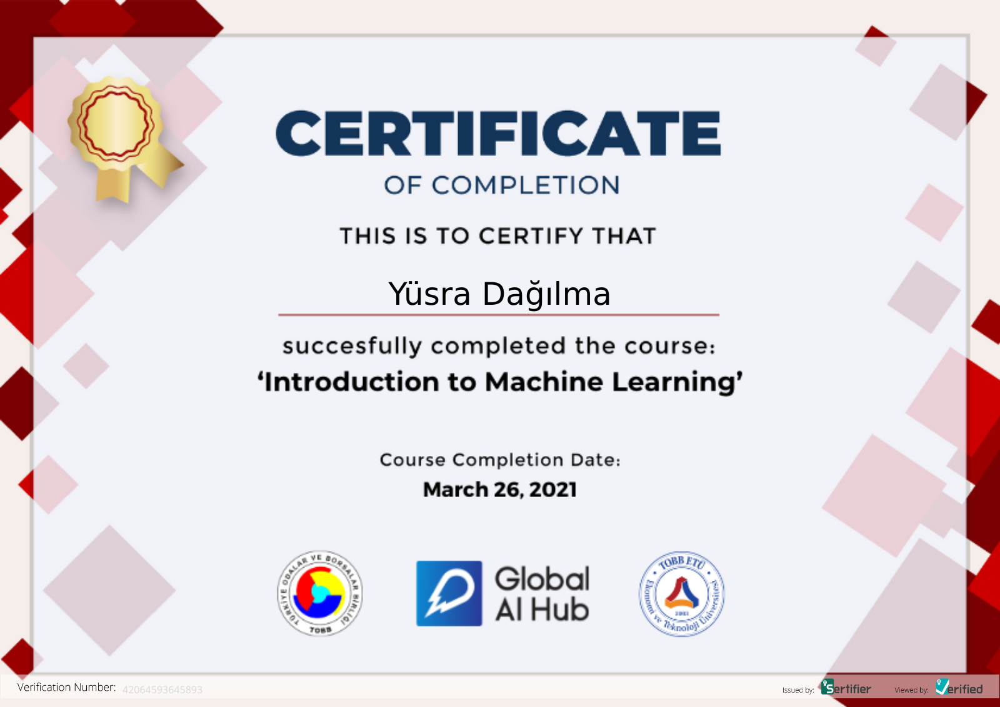

# Global Al Hub Machine Learning Course


**Course Date:** 22.03.2021     
**Name:** Yüsra                    
**Surname:** Dağılma  
**Email:** dagilmayusra@gmail.com  
 

## Project Name
Elmas veri setinin makine öğrenmesi yöntemleriyle düzeltilmesi ve modellenmesi.

## Requirements
```
Scikit-learn (Machine Learning Library)
Python (Programming Language)
Machine Learning Algorithms
```
---

### Certification


